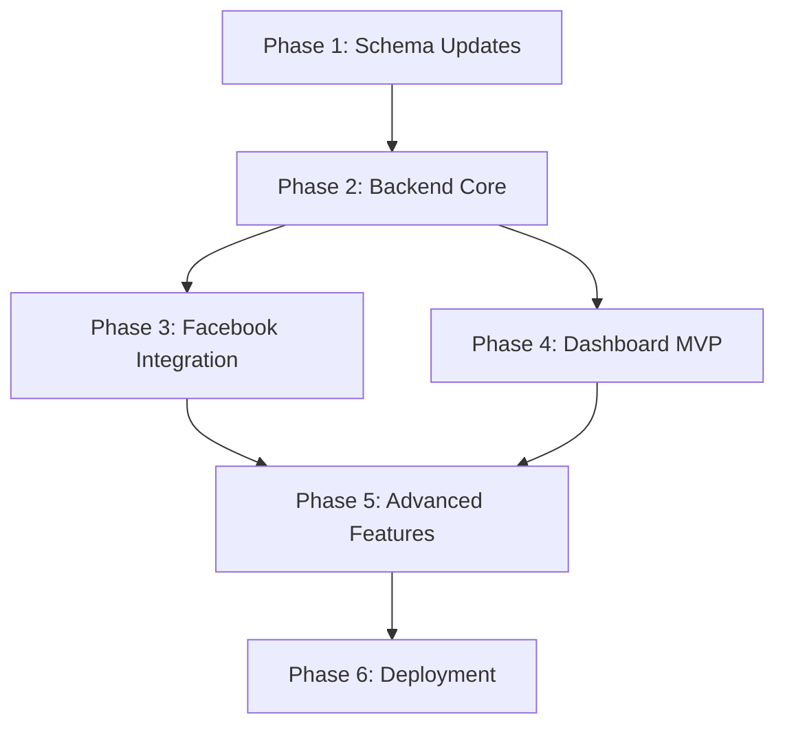

# Production Implementation Plan — AI Sales Bot SaaS

## Overview

Build a production-ready AI-powered sales agent SaaS for F-commerce (Facebook Page sellers in Bangladesh). The system receives Facebook messages/comments, processes them through GPT-4o mini, and replies as a smart salesperson. Business owners manage everything through a Next.js dashboard.

**Current state:** Clean codebase with 10-table Drizzle schema, DB connection, and chatService patterns.
**Target state:** Fully functional multi-tenant SaaS with dashboard, credit billing, and Facebook integration.

---

## Architecture

```
┌─────────────────────────────────────────────────────┐
│                    VPS (Docker)                      │
│                                                      │
│  ┌──────────────┐     ┌───────────────────────┐     │
│  │  Next.js      │     │  Node.js (Express)     │     │
│  │  Dashboard    │────▶│  API + Webhook Server  │     │
│  │  :3001        │     │  :3000                 │     │
│  └──────────────┘     └───────┬───────────────┘     │
│                               │                      │
│              ┌────────────────┼────────────────┐     │
│              ▼                ▼                ▼     │
│         ┌─────────┐   ┌───────────┐    ┌─────────┐  │
│         │ Neon DB  │   │ OpenRouter│    │Facebook │  │
│         │(Postgres)│   │ GPT-4o   │    │Graph API│  │
│         └─────────┘   └───────────┘    └─────────┘  │
└─────────────────────────────────────────────────────┘
```

---

## Phase 1: Schema & Database Updates

Fix gaps between current schema and PRD requirements. The biggest issue: billing model is "subscriptions" but PRD says "Prepaid Credit Recharge."

### [MODIFY] [schema.ts](file:///e:/ai-sales-bot/ai-sales-bot/src/db/schema.ts)

#### 1.1 Add `customers` table (PRD Section 5)

The PRD has a full Customers module with profiles, tags, purchase history. Current schema tracks customers only as `psid` inside conversations. Need a proper customer entity.

```typescript
export const customers = pgTable(
  "customers",
  {
    id: uuid("id").defaultRandom().primaryKey(),
    pageId: uuid("page_id").notNull().references(() => pages.id, { onDelete: "cascade" }),
    psid: text("psid").notNull(),
    name: text("name"),
    profilePicUrl: text("profile_pic_url"),
    tags: jsonb("tags").$type<string[]>().default([]),
    notes: text("notes"),
    status: text("status").default("new").notNull(), // new, interested, purchased, not_interested
    firstSeenAt: timestamp("first_seen_at", { withTimezone: true }).defaultNow().notNull(),
    lastActiveAt: timestamp("last_active_at", { withTimezone: true }).defaultNow().notNull(),
  },
  (table) => ({
    pageIdPsidUnique: unique("customers_page_id_psid_unique").on(table.pageId, table.psid),
    pageIdIdx: index("customers_page_id_idx").on(table.pageId),
  })
);
```

Update `conversations` to reference `customers.id` instead of raw `psid`:

```diff
 export const conversations = pgTable("conversations", {
   ...
-  psid: text("psid").notNull(),
+  customerId: uuid("customer_id").notNull().references(() => customers.id, { onDelete: "cascade" }),
   ...
 });
```

#### 1.2 Add `knowledge_requests` table (PRD Section 10.1)

When AI doesn't know an answer, it creates a request for the business owner.

```typescript
export const knowledgeRequests = pgTable("knowledge_requests", {
  id: uuid("id").defaultRandom().primaryKey(),
  pageId: uuid("page_id").notNull().references(() => pages.id, { onDelete: "cascade" }),
  conversationId: uuid("conversation_id").references(() => conversations.id),
  question: text("question").notNull(),
  answer: text("answer"), // null until owner answers
  status: text("status").default("pending").notNull(), // pending, answered, dismissed
  createdAt: timestamp("created_at", { withTimezone: true }).defaultNow().notNull(),
  answeredAt: timestamp("answered_at", { withTimezone: true }),
});
```

#### 1.3 Add `follow_ups` table (PRD Section 9)

```typescript
export const followUps = pgTable("follow_ups", {
  id: uuid("id").defaultRandom().primaryKey(),
  pageId: uuid("page_id").notNull().references(() => pages.id, { onDelete: "cascade" }),
  customerId: uuid("customer_id").notNull().references(() => customers.id, { onDelete: "cascade" }),
  conversationId: uuid("conversation_id").references(() => conversations.id),
  reason: text("reason"),
  scheduledAt: timestamp("scheduled_at", { withTimezone: true }).notNull(),
  status: text("status").default("scheduled").notNull(), // scheduled, sent, replied, completed, cancelled
  createdAt: timestamp("created_at", { withTimezone: true }).defaultNow().notNull(),
});
```

#### 1.4 Add `sales` table (PRD Section 8)

```typescript
export const sales = pgTable("sales", {
  id: uuid("id").defaultRandom().primaryKey(),
  pageId: uuid("page_id").notNull().references(() => pages.id, { onDelete: "cascade" }),
  customerId: uuid("customer_id").notNull().references(() => customers.id, { onDelete: "cascade" }),
  conversationId: uuid("conversation_id").references(() => conversations.id),
  productId: uuid("product_id").references(() => products.id),
  quantity: integer("quantity").default(1),
  amount: integer("amount").notNull(), // in BDT
  source: text("source").default("inbox").notNull(), // inbox, comment, follow_up
  aiAssisted: boolean("ai_assisted").default(true),
  createdAt: timestamp("created_at", { withTimezone: true }).defaultNow().notNull(),
});
```

#### 1.5 Fix billing: Replace `subscriptions` with `credit_balances`

PRD explicitly says: "No mandatory monthly subscription. Prepaid AI Credit Recharge Model."

```diff
-export const subscriptions = pgTable("subscriptions", { ... });

+export const creditBalances = pgTable("credit_balances", {
+  id: uuid("id").defaultRandom().primaryKey(),
+  userId: text("user_id").notNull().unique().references(() => users.id, { onDelete: "cascade" }),
+  credits: integer("credits").default(0).notNull(),
+  totalPurchased: integer("total_purchased").default(0).notNull(),
+  totalUsed: integer("total_used").default(0).notNull(),
+  updatedAt: timestamp("updated_at", { withTimezone: true }).defaultNow().notNull(),
+});
```

Update `payments` table — rename `plan` to `package` and add `creditsGranted`:

```diff
 export const payments = pgTable("payments", {
   ...
-  plan: text("plan").notNull(),
+  package: text("package").notNull(), // starter, basic, business, pro, enterprise
+  creditsGranted: integer("credits_granted").notNull(),
   ...
 });
```

#### 1.6 Expand `products` table

PRD has: description, discount, stock status, specification, category, sizes/variants, delivery info.

```diff
 export const products = pgTable("products", {
   ...
+  description: text("description"),
+  discount: integer("discount"), // percentage
+  stockStatus: text("stock_status").default("available").notNull(), // available, low_stock, out_of_stock
+  category: text("category"),
+  variants: jsonb("variants").$type<string[]>(), // sizes, colors
+  deliveryInfo: text("delivery_info"),
   ...
 });
```

#### 1.7 Expand `usageLogs` — add cost tracking

```diff
 export const usageLogs = pgTable("usage_logs", {
   ...
+  conversationId: uuid("conversation_id").references(() => conversations.id),
+  creditsDeducted: integer("credits_deducted"),
+  apiCostBdt: integer("api_cost_bdt"), // actual cost in paisa
   ...
 });
```

#### 1.8 Update all Drizzle relations

Add relations for new tables: customers, knowledgeRequests, followUps, sales, creditBalances.

### Migration

After schema changes:
```bash
npx drizzle-kit generate
npx drizzle-kit push
```

---

## Phase 2: Backend Core — Express Server

Build the proper production server replacing the deleted prototype.

### Project Structure

```
src/
├── server.ts                    # Express app entry point
├── config/
│   ├── env.ts                   # Environment validation
│   └── packages.ts              # Credit package definitions
├── db/
│   ├── db.ts                    # Neon connection (exists)
│   └── schema.ts                # Updated schema (Phase 1)
├── services/
│   ├── chatService.ts           # Updated conversation/message ops
│   ├── aiService.ts             # OpenRouter GPT-4o mini integration
│   ├── creditService.ts         # Credit balance, deduction, low-credit checks
│   ├── tokenService.ts          # Encrypt/decrypt page access tokens
│   ├── facebookService.ts       # Send messages, comments, private replies via Graph API
│   ├── knowledgeService.ts      # Build dynamic system prompt from botConfig + faqs + products
│   └── queueService.ts         # Message debounce/buffer (3.5s mutex)
├── routes/
│   ├── webhook.ts               # Facebook webhook GET (verify) + POST (receive)
│   ├── api/                     # Dashboard API routes
│   │   ├── auth.ts              # Better Auth endpoints
│   │   ├── conversations.ts     # Inbox: list, view, takeover, return-to-ai
│   │   ├── customers.ts         # CRUD customers, tags, notes
│   │   ├── products.ts          # CRUD products
│   │   ├── knowledge.ts         # FAQs + knowledge requests
│   │   ├── credits.ts           # Balance, usage, recharge
│   │   ├── settings.ts          # Bot config, business info
│   │   ├── analytics.ts         # Stats queries
│   │   ├── sales.ts             # Sales records
│   │   ├── follow-ups.ts        # Follow-up list, schedule, cancel
│   │   └── overview.ts          # Dashboard summary stats
│   └── middleware/
│       ├── auth.ts              # Better Auth session check
│       └── pageAccess.ts        # Verify user owns the page
└── utils/
    └── prompt.ts                # Dynamic system prompt builder
```

---

### 2.1 Server Entry Point

#### [NEW] `src/server.ts`

- Express app with JSON parsing
- CORS for dashboard origin
- Mount webhook routes at `/webhook`
- Mount API routes at `/api/*`
- Error handling middleware
- Start on PORT 3000

---

### 2.2 Token Encryption Service

#### [NEW] `src/services/tokenService.ts`

Facebook Page Access Tokens stored encrypted in DB. AES-256-CBC using a `TOKEN_SECRET` env var.

```typescript
encrypt(token: string): { encrypted: string; iv: string }
decrypt(encrypted: string, iv: string): string
```

---

### 2.3 Message Queue / Debounce

#### [NEW] `src/services/queueService.ts`

The PRD specifies 3.5-second mutex to prevent race conditions and double replies.

```
Customer sends msg1 → start 3.5s timer
Customer sends msg2 (1s later) → reset timer, append to buffer
Customer sends msg3 (0.5s later) → reset timer, append to buffer
3.5s passes → process all 3 messages as one AI call
```

Key design:
- In-memory `Map<psid, { texts[], attachments[], timeout }>` (from prototype, proven pattern)
- Per-conversation mutex lock to prevent concurrent AI calls for same user
- Configurable delay (default 3500ms)

---

### 2.4 AI Service

#### [NEW] `src/services/aiService.ts`

- OpenRouter client (openai SDK with custom baseURL)
- `generateReply(conversationHistory, systemPrompt, userContent)` → AI response + token usage
- Image handling: download → base64 → vision API
- Returns: `{ reply: string, tokensIn: number, tokensOut: number }`
- Max output tokens: 1000

---

### 2.5 Knowledge / Prompt Builder

#### [NEW] `src/utils/prompt.ts`

Dynamic per-business system prompt assembled from:

```
buildSystemPrompt(botConfig, products[], faqs[]) → string
```

Template:
1. AI persona (from `botConfig.tone`, `botConfig.language`)
2. Business info (from `botConfig.businessInfo`)
3. Product catalog (from `products` table — name, price, stock, variants)
4. FAQs/Policies (from `faqs` table)
5. Custom instructions (from `botConfig.customInstructions`)
6. Conversation flow rules (greeting, sales funnel, upsell)
7. Guardrails (no false info, no off-topic, etc.)
8. Special: "If you don't know the answer, respond with `[KNOWLEDGE_REQUEST: <question>]`"

The server parses AI responses for `[KNOWLEDGE_REQUEST: ...]` markers and creates entries in `knowledge_requests` table.

---

### 2.6 Credit Service

#### [NEW] `src/services/creditService.ts`

```typescript
getBalance(userId): number
deductCredits(userId, amount, usageLogData): boolean // returns false if insufficient
checkLowCredit(userId): "ok" | "low_20" | "low_10" | "low_5" | "zero"
addCredits(userId, package, paymentId): void
```

**Credit deduction formula:**
- 1 AI Credit = 1 conversation turn (one user message → one AI reply)
- Backend tracks actual tokens/cost in `usage_logs` for future pricing adjustments
- If credits = 0 → AI paused, conversation gets status "credit_exhausted"

---

### 2.7 Facebook Service

#### [NEW] `src/services/facebookService.ts`

```typescript
sendMessage(pageAccessToken, recipientPsid, text): Promise<void>
sendPrivateReply(pageAccessToken, commentId, text): Promise<void>
replyToComment(pageAccessToken, commentId, text): Promise<void>
getUserProfile(pageAccessToken, psid): Promise<{name, profilePic}>
```

Uses Graph API v19.0 (or latest stable).

---

### 2.8 Webhook Route

#### [NEW] `src/routes/webhook.ts`

**GET `/webhook`** — Meta verification handshake (verify token check).

**POST `/webhook`** — Receives all Facebook events. Main flow:

```
1. Parse webhook payload
2. Extract pageId from entry
3. Look up page in DB → get decrypted access token, userId, botConfig
4. Check if bot is enabled + credits > 0
5. For messaging events:
   a. Get or create customer (by pageId + psid)
   b. Get or create conversation
   c. Check conversation.status — if "human", skip AI
   d. Feed message into queueService buffer
   e. After 3.5s debounce:
      - Build system prompt (knowledgeService)
      - Get chat history (chatService)
      - Call AI (aiService)
      - Parse response for knowledge requests
      - Deduct credit (creditService)
      - Log usage (usageLogs)
      - Send reply (facebookService)
6. For feed events (comments):
   a. Detect comment on page post
   b. Build stateless prompt (no history) with comment text
   c. AI decides: reply to comment + send private message?
   d. Send "Check Inbox 📩" comment reply
   e. Send detailed private reply with product info
```

> [!IMPORTANT]
> **Human takeover detection:** If `conversation.status === "human"`, skip AI entirely. The webhook still logs the incoming message but doesn't generate a reply. When the owner replies directly via Facebook, we detect it because `sender.id === pageId` — log it as a human message.

---

### 2.9 Dashboard API Routes

All routes protected by Better Auth middleware. User can only access their own pages' data.

#### [NEW] `src/routes/api/conversations.ts`
- `GET /api/conversations?pageId=...&status=...` — List conversations with filters
- `GET /api/conversations/:id` — Full conversation with messages
- `POST /api/conversations/:id/takeover` — Set status to "human"
- `POST /api/conversations/:id/return-to-ai` — Set status to "bot"
- `PATCH /api/conversations/:id/status` — Manual status update (interested, purchased, etc.)

#### [NEW] `src/routes/api/customers.ts`
- `GET /api/customers?pageId=...` — List customers with search/filter
- `GET /api/customers/:id` — Customer profile with conversation history
- `PATCH /api/customers/:id` — Update tags, notes, status

#### [NEW] `src/routes/api/products.ts`
- `GET /api/products?pageId=...` — List products
- `POST /api/products` — Create product
- `PATCH /api/products/:id` — Update product (price, stock, etc.)
- `DELETE /api/products/:id` — Soft delete (set inactive)

#### [NEW] `src/routes/api/knowledge.ts`
- `GET /api/faqs?pageId=...` — List FAQs
- `POST /api/faqs` — Add FAQ entry
- `PATCH /api/faqs/:id` — Update FAQ
- `DELETE /api/faqs/:id` — Remove FAQ
- `GET /api/knowledge-requests?pageId=...&status=pending` — Unanswered questions from AI
- `POST /api/knowledge-requests/:id/answer` — Owner answers → optionally saves to FAQs

#### [NEW] `src/routes/api/credits.ts`
- `GET /api/credits/balance` — Current credit balance
- `GET /api/credits/usage?from=...&to=...` — Usage history
- `GET /api/credits/packages` — Available recharge packages
- `POST /api/credits/recharge` — Process recharge (integrate payment later)

#### [NEW] `src/routes/api/settings.ts`
- `GET /api/settings/:pageId` — Get bot config
- `PATCH /api/settings/:pageId` — Update bot config (tone, language, instructions, etc.)
- `GET /api/settings/:pageId/business` — Business info
- `PATCH /api/settings/:pageId/business` — Update business info

#### [NEW] `src/routes/api/overview.ts`
- `GET /api/overview?pageId=...` — Summary: credits, conversations today, new customers, sales, follow-ups due, attention-required items

#### [NEW] `src/routes/api/analytics.ts`
- `GET /api/analytics/customers?pageId=...&period=...`
- `GET /api/analytics/conversations?pageId=...&period=...`
- `GET /api/analytics/sales?pageId=...&period=...`
- `GET /api/analytics/credits?pageId=...&period=...`

#### [NEW] `src/routes/api/sales.ts`
- `GET /api/sales?pageId=...` — List sales
- `POST /api/sales` — Record a sale (manual or AI-detected)

#### [NEW] `src/routes/api/follow-ups.ts`
- `GET /api/follow-ups?pageId=...&status=...` — List follow-ups
- `POST /api/follow-ups` — Schedule follow-up
- `PATCH /api/follow-ups/:id` — Update/cancel

---

## Phase 3: Facebook Integration

### 3.1 Webhook Subscription Setup

#### [NEW] `src/config/facebook.ts`

Constants:
```typescript
VERIFY_TOKEN: string          // from env
GRAPH_API_VERSION: "v19.0"
WEBHOOK_FIELDS: ["messages", "messaging_postbacks", "feed"]
```

### 3.2 Comment Handling Flow

When a comment arrives on a subscribed page's post:

```
1. Comment webhook event received
2. Extract: comment_id, post_id, page_id, commenter info, comment text
3. Look up page → get bot config + products
4. Build stateless prompt:
   "Someone commented on a post: '<comment text>'. 
    Analyze the intent. If they're asking about price/product:
    - Generate a private message with product details
    - Reply to the comment: 'Check Inbox 📩'"
5. AI generates both responses
6. Send comment reply via Graph API
7. Send private message via Graph API (Private Reply)
8. Create customer + conversation if needed
9. Deduct credit
```

### 3.3 Owner Message Detection

When the page itself sends a message (owner or moderator replying directly on Facebook):

```
1. Webhook receives message where sender.id === page.fbPageId
2. This means the owner replied directly
3. Log message as role="human" in messages table
4. If conversation.status === "bot", auto-switch to "human"
   (prevents AI from replying on top of human reply)
```

---

## Phase 4: Next.js Dashboard

### Setup

```bash
npx -y create-next-app@latest ./dashboard --typescript --tailwind --eslint --app --src-dir --import-alias "@/*" --no-turbo
```

> [!IMPORTANT]
> **Design question:** The PRD doesn't specify Tailwind explicitly. The existing scaffold used it. The project's Next.js frontend will use TailwindCSS + shadcn/ui for rapid, polished development since both were already installed in the previous scaffold. Let me know if you prefer vanilla CSS instead.

### Dashboard Structure

```
dashboard/
├── src/
│   ├── app/
│   │   ├── layout.tsx                # Root layout + sidebar nav
│   │   ├── page.tsx                  # Redirect to /overview
│   │   ├── login/page.tsx            # Login page
│   │   ├── register/page.tsx         # Register page
│   │   ├── (dashboard)/              # Protected layout group
│   │   │   ├── layout.tsx            # Dashboard shell (sidebar + topbar)
│   │   │   ├── overview/page.tsx     # Summary cards + attention required
│   │   │   ├── inbox/
│   │   │   │   ├── page.tsx          # Conversation list
│   │   │   │   └── [id]/page.tsx     # Conversation detail + chat view
│   │   │   ├── customers/
│   │   │   │   ├── page.tsx          # Customer list
│   │   │   │   └── [id]/page.tsx     # Customer profile
│   │   │   ├── products/page.tsx     # Product CRUD
│   │   │   ├── sales/page.tsx        # Sales list
│   │   │   ├── follow-ups/page.tsx   # Follow-up list
│   │   │   ├── knowledge/page.tsx    # FAQs + knowledge requests
│   │   │   ├── activity/page.tsx     # AI activity log
│   │   │   ├── analytics/page.tsx    # Charts + stats
│   │   │   ├── credits/page.tsx      # Balance + recharge + history
│   │   │   ├── notifications/page.tsx
│   │   │   ├── settings/page.tsx     # Bot config + business info
│   │   │   └── accounts/page.tsx     # Connected Facebook pages
│   │   └── api/                      # Next.js API routes (proxy to Express or Better Auth)
│   ├── components/
│   │   ├── sidebar.tsx
│   │   ├── topbar.tsx
│   │   ├── chat-window.tsx           # Message thread UI
│   │   ├── stat-card.tsx
│   │   ├── data-table.tsx            # Reusable table
│   │   └── ui/                       # shadcn components
│   └── lib/
│       ├── api.ts                    # Fetch wrapper for Express API
│       └── auth.ts                   # Better Auth client
```

### MVP Dashboard Pages (matching PRD Section 21)

| # | Page | Key Features |
|---|---|---|
| 1 | **Overview** | Summary cards (credits, conversations, customers, sales), attention-required list, today's stats |
| 2 | **Inbox** | Conversation list with status/AI indicators, chat view, take over / return to AI buttons, real-time message display |
| 3 | **Customers** | Customer list with search, profile view with conversation history, tags, notes |
| 4 | **Products** | Product table, add/edit form (name, price, stock, image, variants), stock toggle |
| 5 | **Sales** | Sales list with source tracking (inbox/comment/follow-up), AI vs human assisted |
| 6 | **Follow-ups** | Scheduled/due/sent list, manual schedule form |
| 7 | **AI Knowledge** | FAQ editor, pending knowledge requests with "answer & save" flow |
| 8 | **AI Activity** | Activity feed: comment reply, inbox message, follow-up sent, knowledge request, errors |
| 9 | **Analytics** | Customer/conversation/sales charts (daily, weekly, monthly) |
| 10 | **Credits** | Balance display, usage chart, recharge packages, payment history |
| 11 | **Notifications** | Low credit, new lead, takeover required, AI errors |
| 12 | **Settings** | Bot controls (tone, language, emoji, follow-up timing), business info form |
| 13 | **Connected Accounts** | Facebook page connection status (manual in MVP — shows static status) |

---

## Phase 5: Advanced Backend Features

### 5.1 Follow-up Scheduler

#### [NEW] `src/services/followUpService.ts`

A simple interval-based scheduler (runs every minute):

```
1. Query follow_ups WHERE status = "scheduled" AND scheduledAt <= NOW()
2. For each due follow-up:
   a. Get customer + conversation
   b. Generate follow-up message via AI
   c. Send via Facebook
   d. Update follow_up status to "sent"
   e. Deduct credit
```

No external scheduler needed — `setInterval` in Node.js process is sufficient for MVP scale (10-15 clients).

### 5.2 Human Takeover Intelligence

Enhance the webhook to detect scenarios requiring human attention:

- Customer says "manager", "human", "real person" → auto-flag
- AI response contains `[KNOWLEDGE_REQUEST]` → flag as "attention required"
- Customer sends angry/frustrated messages → AI detects and flags
- Customer is ready to purchase → flag as "hot lead"

Store flags in `conversations` table as `attention_reason` text field.

### 5.3 Conversation Summarization

When message count exceeds sliding window (>15 messages):

```
1. Take oldest messages outside window
2. Send to AI: "Summarize this conversation so far in 2-3 sentences"
3. Store summary in conversations.summary
4. Set conversations.summarizedUpto timestamp
5. When building chat history, prepend summary as first context message
```

This keeps context quality high while controlling token costs.

---

## Phase 6: Deployment & Infrastructure

### 6.1 VPS Setup

- Ubuntu VPS (DigitalOcean / Hetzner / local provider)
- Docker + Docker Compose for both services
- Nginx reverse proxy with SSL (Let's Encrypt)
- PM2 or Docker restart policy for process management

### 6.2 Docker Compose

```yaml
services:
  backend:
    build: .
    ports: ["3000:3000"]
    env_file: .env
    restart: always

  dashboard:
    build: ./dashboard
    ports: ["3001:3001"]
    env_file: ./dashboard/.env
    restart: always

  nginx:
    image: nginx:alpine
    ports: ["80:80", "443:443"]
    volumes:
      - ./nginx.conf:/etc/nginx/nginx.conf
      - ./certs:/etc/letsencrypt
    restart: always
```

### 6.3 Environment Variables (Production)

```
# Backend
DATABASE_URL=
OPENROUTER_API_KEY=
TOKEN_SECRET=            # For encrypting FB page tokens
VERIFY_TOKEN=            # Facebook webhook verification
BETTER_AUTH_SECRET=      # Session signing
DASHBOARD_URL=           # CORS origin

# Dashboard
NEXT_PUBLIC_API_URL=     # Express backend URL
BETTER_AUTH_URL=         # Auth endpoint
```

### 6.4 Domain Structure

```
app.yourdomain.com     → Next.js Dashboard
api.yourdomain.com     → Express API + Webhook
```

Facebook webhook URL: `https://api.yourdomain.com/webhook`

---

## Build Order & Dependencies



### Recommended execution order:

| Step | What | Depends On | Est. Effort |
|------|------|-----------|-------------|
| 1 | Schema updates + migration | — | 1 day |
| 2 | tokenService, env config | Schema | 0.5 day |
| 3 | chatService (updated), aiService | Schema | 1 day |
| 4 | queueService, knowledgeService/prompt builder | chatService, aiService | 1 day |
| 5 | creditService | Schema | 0.5 day |
| 6 | facebookService | — | 0.5 day |
| 7 | Webhook route (messages) | All services | 1 day |
| 8 | Webhook route (comments) | Webhook messages | 0.5 day |
| 9 | Dashboard API routes | All services | 2 days |
| 10 | Next.js setup + auth + layout | — | 1 day |
| 11 | Dashboard pages (13 pages) | API routes | 5-7 days |
| 12 | Follow-up scheduler | creditService, facebookService | 1 day |
| 13 | Conversation summarization | aiService | 0.5 day |
| 14 | Testing + bug fixes | Everything | 2-3 days |
| 15 | VPS deployment | Everything | 1 day |

**Total estimated: ~18-22 days of focused work**

---

## Verification Plan

### Automated Tests
```bash
# Schema validation
npx drizzle-kit push --dry-run

# API smoke tests (after backend is built)
npx tsx src/tests/api-smoke.ts
```

### Manual Verification
1. **Webhook test:** Send message to connected FB page → verify AI replies
2. **Credit flow:** Recharge → send messages → verify deduction → hit zero → verify AI pauses
3. **Human takeover:** Take over from dashboard → verify AI stops → return to AI → verify AI resumes
4. **Comment flow:** Comment on page post → verify "Check Inbox" reply + private message
5. **Knowledge request:** Ask AI something it doesn't know → verify request appears in dashboard → answer it → verify AI uses new knowledge
6. **Dashboard:** Navigate all 13 pages, verify data loads correctly

---

## Open Questions

> [!IMPORTANT]
> **Payment gateway:** Which payment gateway for credit recharge? bKash, Nagad, SSLCommerz? This affects the `POST /api/credits/recharge` implementation. Can be manual (owner sends money, you activate) for MVP.

> [!IMPORTANT]
> **Auth provider:** The previous scaffold had `better-auth` installed. Still want to use Better Auth, or switch to something else (NextAuth, Clerk, etc.)?

> [!IMPORTANT]
> **Real-time updates:** Should the dashboard inbox show new messages in real-time (requires WebSocket/SSE), or is polling (refresh every 5-10 seconds) acceptable for MVP?

> [!WARNING]
> **VERIFY_TOKEN exposure:** The `.env` file currently has real credentials committed. Before any git push, ensure `.gitignore` includes `.env`. Also rotate the exposed PAGE_ACCESS_TOKEN and OPENROUTER_API_KEY since they were visible in the codebase.
